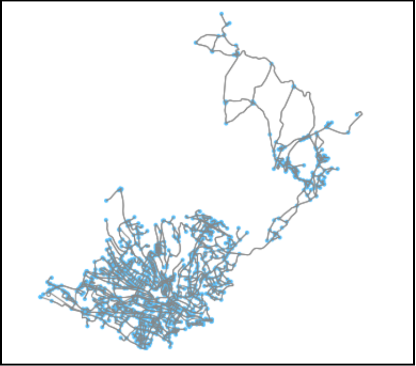

# Geospatial Data Analys

Set of past and current projects involving geospatial data:

1 - [AMLD-2020](https://github.com/caiomiyashiro/geospatial_data_analysis/tree/master/AMLD-2020) - Material used for the workshop `Feature Engineering for Spatial Data Analysis in the Context of Fare Prediction` at [Applied Machine Learning Days](https://appliedmldays.org/) at Lausanne 2020.

  
  
  

2 - [art_heat_maps](https://github.com/caiomiyashiro/geospatial_data_analysis/tree/master/art_heat_maps) - Materials presented at PyBerlin 2020 - `Creating your own stylised maps with Python`

